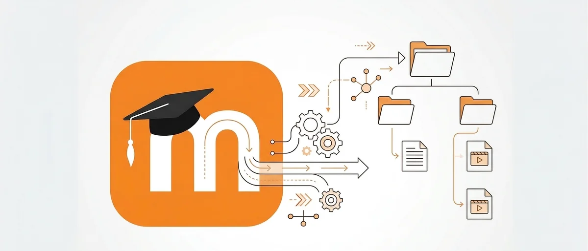
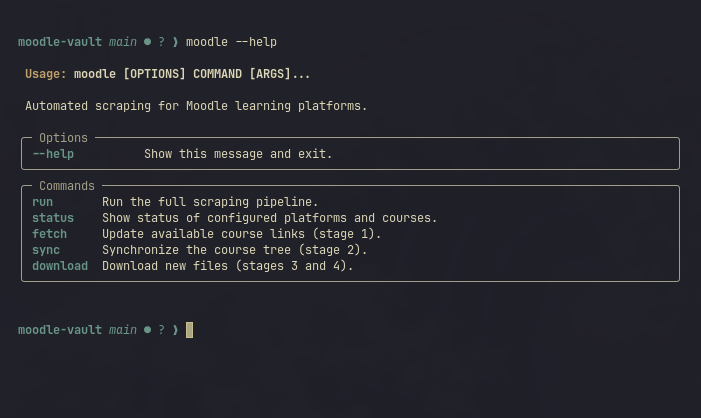
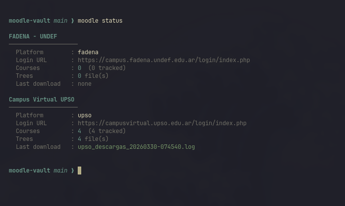

# moodle vault

<p align="center">
   <picture>
   <source media="(prefers-color-scheme: dark)" srcset="./assets/banner_dark.png">
   <source media="(prefers-color-scheme: light)" srcset="./assets/banner_light.png">
   
   </picture>
</p>

<p align="center">


[](https://github.com/matzalazar/moodle-vault/actions/workflows/ci.yml)

</p>

A command-line tool that automatically downloads, organizes, and archives content from Moodle learning platforms. It uses headless Selenium to navigate the platform, extracts each course's hierarchical structure, and downloads relevant files organized locally by course, week, and topic.

> [Versión en español](README_es.md)

## Features

- Installable Python CLI (`moodle` command) powered by Typer — no bash required.
- Automatic authentication with per-platform credentials.
- Course discovery with interactive tracking selection.
- Hierarchical course structure extraction (sections, topics, materials) stored as JSON.
- File downloads filtered by relevant extensions (`.pdf`, `.docx`, `.ipynb`, `.py`, `.mp4`, and more).
- YouTube playlist detection for external link activities.
- Selective re-scraping of recent weeks for late-uploaded content.
- Incremental processing: already-processed topics are skipped on subsequent runs.
- Multi-platform support via independent configuration files.
- Optional Todoist and Notion integrations, configurable per platform from `.env`.
- Download log with metadata (timestamp, course, week, topic, filename).

## Screenshots




## How it works

```
moodle run
  │
  ├─ fetch         Navigates to "My courses" and extracts course URLs.
  │                On first run, asks interactively which to track.
  │
  ├─ sync          For each tracked course, builds a JSON tree with
  │                sections, topics, and date metadata.
  │                Each run merges with the previous structure,
  │                preserving the state of already-downloaded topics.
  │
  ├─ reset         (optional) Clears the "revisado" flag for topics
  │                in the last 1 or 2 weeks, forcing them to be
  │                re-downloaded in the current run.
  │
  └─ download      Walks the tree, opens each topic in the browser,
                   and downloads any files found. /mod/url/ activities
                   are resolved to detect YouTube playlists.
```

## Project structure

```
cli/
├── __init__.py
└── commands.py            # All Typer commands (moodle run/status/fetch/sync/download)

scripts/
├── platform.py            # PlatformConfig dataclass, load_platform(), list_platforms()
├── utils.py               # Sanitization, logging, and helpers
├── scraper/
│   ├── selectors.py       # CSS selectors and Selenium constants
│   ├── session.py         # Browser management and authentication
│   ├── fetch_links.py     # Stage 1: course URL extraction
│   ├── extract_course_tree.py  # Stage 2: hierarchical tree generation
│   ├── reset_semanas.py   # Stage 3: recent-week re-scraping
│   └── download_files.py  # Stage 4: file downloading
└── integrations/
    ├── todoist.py         # Todoist integration (optional)
    └── notion.py          # Notion integration (optional)

config/
├── platforms/
│   └── <platform>.json    # Platform login URL and display name
└── <platform>/
    └── course_links.json  # Selected courses and tracking preferences

data/
└── <platform>/
    ├── trees/             # Hierarchical course structures (JSON)
    └── course/            # Downloaded files organized by course

logs/                      # Per-session download logs
tests/                     # Unit test suite (111 tests)
main.py                    # Alternative entry point (no install required)
pyproject.toml             # Package definition and entry points
requirements.txt           # Flat dependency list
```

## Requirements

- Python 3.10+
- Google Chrome or Chromium

## Installation

```bash
git clone https://github.com/matzalazar/moodle-vault.git
cd moodle-vault
python -m venv venv && source venv/bin/activate
pip install -e .
```

Set up environment variables:

```bash
cp .env.example .env
# Edit .env with your credentials and optional tokens
```

## Platform configuration

Create `config/platforms/<name>.json`:

```json
{
  "display_name": "Platform display name",
  "login_url": "https://campus.university.edu/login/index.php"
}
```

Credentials go in `.env` prefixed with the platform name in uppercase:

```env
MYPLATFORM_USERNAME=user@email.com
MYPLATFORM_PASSWORD=password
```

Each platform gets its own data directory at `config/<name>/` and `data/<name>/`.

## Usage

After installation, the `moodle` command is available globally in the active virtual environment.

### `moodle run` — full pipeline

Runs all four stages: fetch, sync, optional reset, and download. Triggers enabled integrations when done.

```bash
moodle run
moodle run --platform myplatform
moodle run --platform myplatform --rescrape 1
moodle run --platform myplatform --yes          # skip interactive prompts (CI-friendly)
moodle run --verbose
```

Options:

| Flag | Short | Description |
|------|-------|-------------|
| `--platform` | `-p` | Platform name (skips selection menu) |
| `--rescrape` | `-r` | Re-scrape recent weeks: `0` = no, `1` = last week, `2` = last two weeks |
| `--verbose` | `-v` | Enable debug logging |
| `--yes` | `-y` | Skip interactive prompts |

### `moodle status` — platform info

Shows configured platforms, course counts, tree files, and last download log. No browser required.

```bash
moodle status
moodle status --platform myplatform
```

Options: `--platform / -p`, `--verbose / -v`

### `moodle fetch` — stage 1 only

Opens the browser, navigates to the course list, and updates `course_links.json`.

```bash
moodle fetch
moodle fetch --platform myplatform
```

Options: `--platform / -p`, `--verbose / -v`

### `moodle sync` — stage 2 only

Rebuilds the JSON course tree for each tracked course, merging with the previous structure.

```bash
moodle sync
moodle sync --platform myplatform
```

Options: `--platform / -p`, `--verbose / -v`

### `moodle download` — stages 3 and 4

Optionally resets recent weeks, then downloads new files and triggers integrations.

```bash
moodle download
moodle download --platform myplatform --rescrape 2
moodle download --yes
```

Options: `--platform / -p`, `--rescrape / -r`, `--verbose / -v`, `--yes / -y`

## Course selection

On the first run, each course is listed and you choose whether to track it. The selection is saved in `config/<platform>/course_links.json` under `"seguimiento": true`.

On subsequent runs, only tracked courses are processed. To change the selection, edit that file manually.

## Re-scraping recent weeks

When running `moodle run` or `moodle download` without `--yes`, you are prompted:

```
Re-scrape weeks with late-uploaded content?
  [0] no  (default)
  [1] last week
  [2] last two weeks

Option [0]:
```

Choosing `1` or `2` clears the `revisado` flag for all topics whose week ended within that window, so `download_files` processes them again. Earlier weeks are not affected. This is useful when an instructor uploads material late and those topics were already marked as processed in a previous run.

You can also pass `--rescrape 1` or `--rescrape 2` directly to skip the prompt.

## Integrations

### Configuration

Todoist and Notion integrations are enabled independently per platform in `.env`. They only run when the corresponding flag is set to `true`.

```env
# Shared tokens
TODOIST_TOKEN=your_todoist_token
NOTION_TOKEN=your_notion_token
NOTION_DATABASE_ID=your_database_id

# Per-platform flags
MYPLATFORM_TODOIST_ENABLED=true
MYPLATFORM_NOTION_ENABLED=false
```

### Notion

1. Create an integration at [notion.so/my-integrations](https://www.notion.so/my-integrations).
2. Create a database with columns: `Archivo` (title), `Curso`, `Semana`, `Tema` (rich text), `Plataforma` (select), `Fecha` (date).
3. Share the database with the integration.
4. Copy the database ID from the URL (before `?v=`).
5. Set the token, database ID, and `{PLATFORM}_NOTION_ENABLED=true` in `.env`.

If your database uses different column names, override them with optional environment variables:

```env
NOTION_PROP_ARCHIVO=Archivo
NOTION_PROP_CURSO=Curso
NOTION_PROP_SEMANA=Semana
NOTION_PROP_TEMA=Tema
NOTION_PROP_PLATAFORMA=Plataforma
NOTION_PROP_FECHA=Fecha
```

### Todoist

1. Get your API token from [app.todoist.com/app/settings/integrations/developer](https://app.todoist.com/app/settings/integrations/developer).
2. Set the token and `{PLATFORM}_TODOIST_ENABLED=true` in `.env`.

A task is created for each downloaded file, due today, with medium priority.

## Tests

```bash
pytest
```

The suite contains 131 tests covering all pure functions across every module: sanitization, platform config loading, filename inference, activity type detection, incremental structure merging, recent-week reset, log parsing, and CLI command behavior.

## Sample logs

The `logs/example.log` file contains output from a real run. Instructor names have been replaced with `[LECTURER A]` and `[LECTURER B]`, absolute paths with `/path/to/project/`, and URL IDs with `XXXXXXX`.

This file is versioned as real execution evidence for portfolio purposes. It is anonymized and does not contain credentials, API tokens, or session cookies.

## Adding other platforms

If you use Moodle at another educational institution and would like it included as a reference platform, feel free to [open an Issue](../../issues/new) in the repository. Include the institution name and the platform's login URL.

## Roadmap

- Google Calendar sync
- Telegram notifications

## License

[MIT](LICENSE)
